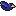

<!-- PROJECT SHIELDS -->
<!--
*** I'm using markdown "reference style" links for readability.
*** Reference links are enclosed in brackets [ ] instead of parentheses ( ).
*** See the bottom of this document for the declaration of the reference variables
*** for contributors-url, forks-url, etc. This is an optional, concise syntax you may use.
*** https://www.markdownguide.org/basic-syntax/#reference-style-links
-->
[![Contributors][contributors-shield]][contributors-url]
[![Forks][forks-shield]][forks-url]
[![Stargazers][stars-shield]][stars-url]
[![Issues][issues-shield]][issues-url]
[![project_license][license-shield]][license-url]
[![LinkedIn][linkedin-shield]][linkedin-url]

<!-- PROJECT LOGO -->
 

  

<h3 align="center">Flappy Bird</h3>

  

     
    <a href="https://yousifj129.github.io/Flappy-bird-game/">View Demo</a>
    &middot;
    <a href="https://github.com/yousifj129/Flappy-bird-game/issues/new?labels=bug&template=bug-report---.md">Report Bug</a>
    &middot;
    <a href="https://github.com/yousifj129/Flappy-bird-game/issues/new?labels=enhancement&template=feature-request---.md">Request Feature</a>
  

<!-- TABLE OF CONTENTS -->

  
Table of Contents

  <ol>
    <li>
      <a href="#about-the-project">About The Project</a>
      <ul>
        <li><a href="#built-with">Built With</a></li>
      </ul>
    </li>
    <li>
      <a href="#getting-started">Getting Started</a>
    </li>
    <li><a href="#roadmap">Roadmap</a></li>
    <li><a href="#contributing">Contributing</a></li>
    <li><a href="#license">License</a></li>
    <li><a href="#contact">Contact</a></li>
    <li><a href="#acknowledgments">Acknowledgments</a></li>
  </ol>

<!-- ABOUT THE PROJECT -->
## About The Project

[![Product Name Screen Shot][product-screenshot]](https://example.com)

Here's a blank template to get started. To avoid retyping too much info, do a search and replace with your text editor for the following: `github_username`, `repo_name`, `twitter_handle`, `linkedin_username`, `email_client`, `email`, `project_title`, `project_description`, `project_license`

(<a href="#readme-top">back to top</a>)

### Built With

* HTML
* Javascript
* CSS

(<a href="#readme-top">back to top</a>)

<!-- GETTING STARTED -->
## Getting Started

Fork this repository and run the game, it doesn't require any packages or modules as it's made in plain HTML and Javascript and CSS.

<!-- ROADMAP -->
## Roadmap

- [x] Grid-based game
- [x] Randomly generated obstacles with the ability to increase difficulty
- [x] dynamic layout that scales on smaller devices

(<a href="#readme-top">back to top</a>)

<!-- CONTRIBUTING -->
## Contributing

Contributions are what make the open source community such an amazing place to learn, inspire, and create. Any contributions you make are **greatly appreciated**.

1. Fork the Project
2. Create your Feature Branch (`git checkout -b feature/AmazingFeature`)
3. Commit your Changes (`git commit -m 'Add some AmazingFeature'`)
4. Push to the Branch (`git push origin feature/AmazingFeature`)
5. Open a Pull Request

(<a href="#readme-top">back to top</a>)

### Top contributors:

<!-- LICENSE -->
## License

Distributed under the project_license. See `LICENSE.txt` for more information.

(<a href="#readme-top">back to top</a>)

<!-- CONTACT -->
## Contact

Project Link: [https://github.com/yousifj129/Flappy-bird-game](https://github.com/yousifj129/Flappy-bird-game)

(<a href="#readme-top">back to top</a>)

<!-- ACKNOWLEDGMENTS -->
## Acknowledgments

* <a href="https://ma9ici4n.itch.io/pixel-art-bird-16x16">source of bird image<a>
* <a href="https://github.com/autruonggiang/build-a-flappy-bird-clone-with-phaser">source of background<a>
* <a href="https://poppop.ai/ai-sound-effect-generator">source of sound effects<a>
* <a href="https://poppop.ai/sound-effects/jump-sound">source of background music<a>

(<a href="#readme-top">back to top</a>)

<!-- MARKDOWN LINKS & IMAGES -->
<!-- https://www.markdownguide.org/basic-syntax/#reference-style-links -->
[contributors-shield]: https://img.shields.io/github/contributors/yousifj129/Flappy-bird-game.svg?style=for-the-badge
[contributors-url]: https://github.com/yousifj129/Flappy-bird-game/graphs/contributors
[forks-shield]: https://img.shields.io/github/forks/yousifj129/Flappy-bird-game.svg?style=for-the-badge
[forks-url]: https://github.com/yousifj129/Flappy-bird-game/network/members
[stars-shield]: https://img.shields.io/github/stars/yousifj129/Flappy-bird-game.svg?style=for-the-badge
[stars-url]: https://github.com/yousifj129/Flappy-bird-game/stargazers
[issues-shield]: https://img.shields.io/github/issues/yousifj129/Flappy-bird-game.svg?style=for-the-badge
[issues-url]: https://github.com/yousifj129/Flappy-bird-game/issues
[license-shield]: https://img.shields.io/github/license/yousifj129/Flappy-bird-game.svg?style=for-the-badge
[license-url]: https://github.com/yousifj129/Flappy-bird-game/blob/master/LICENSE.txt
[linkedin-shield]: https://img.shields.io/badge/-LinkedIn-black.svg?style=for-the-badge&logo=linkedin&colorB=555
[linkedin-url]: https://www.linkedin.com/in/yousif-salman-094b9a2a4/
[product-screenshot]: ./Assets/Screenshot.png
[html-url]: 